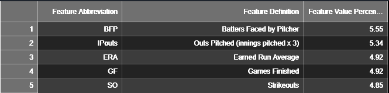
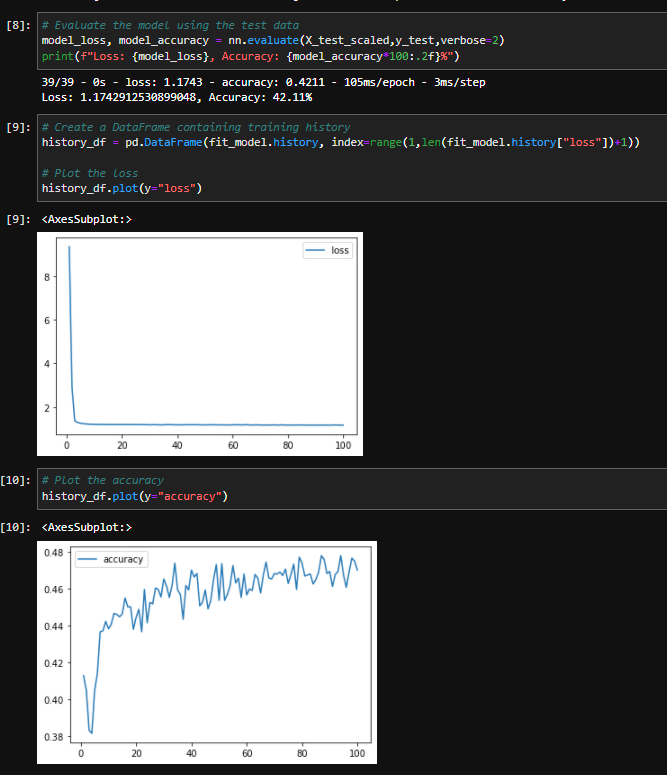
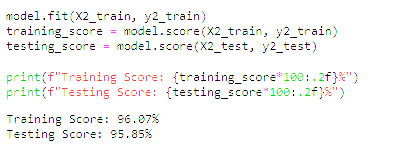
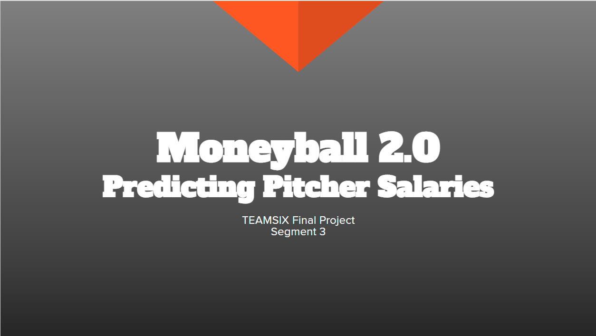
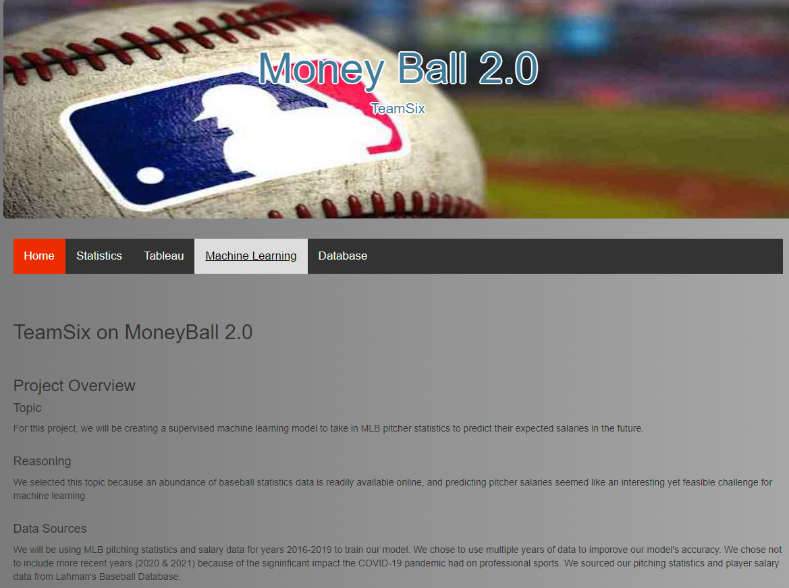
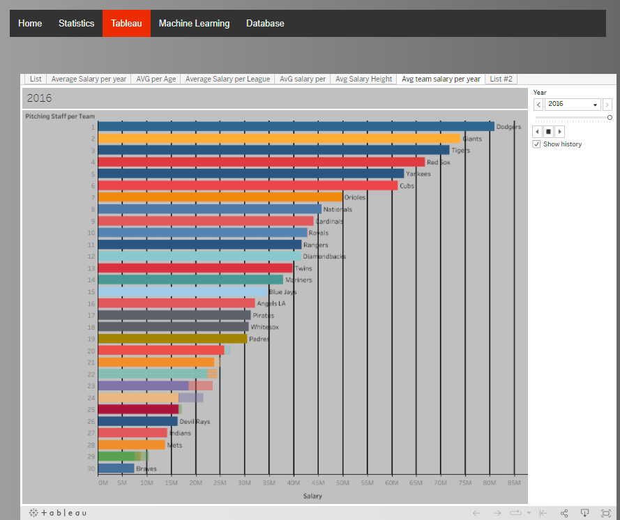

# Moneyball 2.0

## Table of Contents
- [Overview](https://github.com/Jenny16x/TeamSix#project-overview)
- [Data Preprocessing](https://github.com/Jenny16x/TeamSix#data-preprocessing)
- [Model Selection Process](https://github.com/Jenny16x/TeamSix#model-selection-process)
    - [Exploratory Analysis](https://github.com/Jenny16x/TeamSix#exploratory-analysis)
    - [Random Forest Analysis](https://github.com/Jenny16x/TeamSix#random-forest-analysis)
    - [Updated Random Forest Analysis](https://github.com/Jenny16x/TeamSix#updated-random-forest-analysis)
    - [Neural Network Model](https://github.com/Jenny16x/TeamSix#neural-network-model)
    - [Multivariate Regression Model](https://github.com/Jenny16x/TeamSix#multivariate-regression-model)
    - [Polynomial Regression Analysis](https://github.com/Jenny16x/TeamSix#polynomial-regression-analysis)
- [The Final Model](https://github.com/Jenny16x/TeamSix#the-final-model)
- [Database](https://github.com/Jenny16x/TeamSix#database)
- [Presentation](https://github.com/Jenny16x/TeamSix#presentation---google-slides)
- [Dashboard](https://github.com/Jenny16x/TeamSix#dashboard)

## Project Overview

### Topic
For this project, we created a supervised machine learning linear regression model to predict MLB pitcher salary based on their Earned Run Average (ERA).
 

### Reasoning
We selected this topic because an abundance of baseball statistics data is readily available online, and predicting pitcher salaries seemed like an interesting yet feasible challenge for machine learning.
 

### Data Sources
We will be using MLB pitching statistics and salary data for years 1990-2016 to train our model. We chose to use a large range of years to ensure we had an adequate amount of data to work with to train and test our model. We chose not to include more recent years (2020 & 2021) because of the signinficant impact the COVID-19 pandemic had on professional sports. 

We sourced our pitching statistics and player salary data from [Lahman's Baseball Database.](http://www.seanlahman.com/baseball-archive/statistics/)
 

## What We Plan to Answer with Data
We were hoping to create a model that could accurately predict what a starting MLB pitcher's salary would be based on their ERA.
 

[*jump to top*](https://github.com/Jenny16x/TeamSix#moneyball-20)

 

# Data Preprocessing

The following files from the Lahman Database were merged and used to create the dataset for our model:
- [`Salaries.csv`](./resources/LahmanData/Salaries.csv)
    - contains salary data for all players
- [`People.csv`](./resources/LahmanData/People.csv)
    - contains demographic information for all players
        - ex. Height, weight, L/R handed, birthplace, etc.
- [`Pitching.csv`](./resources/LahmanData/Pitching.csv)
    - contains pitching statistics for all players who have pitched
 

After creating our initial dataset, we began cleaning up the data for use in our model. The dataset was filtered using Pandas as follows: 
1. `Years` column filtered to include only 1990-2016
2. Included only pitchers with >= 3 games started (GS)
3. Null values were filtered out
4. Columns/features that clearly did not contribute to salary were dropped from the dataset
    - ex. birth city, country of birth, city of birth, etc. 

With the dataframe effectively filtered and cleaned, the final steps were to organize the columns in a way that made sense and export the file as [`pitcher_salaries_cleaned.csv`](./data-cleaning/pitcher_salaries_cleaned.csv).
 

[*jump to top*](https://github.com/Jenny16x/TeamSix#moneyball-20)

 

# Exploratory Analysis
Our first exploratory analysis looking at salaries vs ERA can be found [here](./model-selection/exploratory-analysis_linear-regression/Segment_1_ML_Model.ipynb). 

*Note: This analysis was performed prior to creating our final dataset*

To determine the initial machine learning model, we analyzed a dataset from 2010-2016 that had baseball salary and ERA statistics. we chose to use linear regression since we expected a somewhat linear relationship between pitcher ERA and their salary (pitchers with lower ERA would have higher salaries and vice versa).

The linear regression line was fit based on the initial data and produced the following model with a training and testing score of .97.

 

# Model Selection Process

Although we had a good accuracy score with linear regression using only ERA to determine salary, we decided to try and evaluate several other more complex models that could take into account several pitching statistics as features to more accurately predict pitcher salary.

We tested the following models with varying results:
- Random Forest 
- Neural Network (Regression and Classification)
- Polynomial Regression
- Multivariate Regression

## Random Forest Analysis
>[Random Forest Folder](https://github.com/Jenny16x/TeamSix/tree/main/model-selection/random-forest-analysis) 
>[Random Forest Analysis Details](https://github.com/Jenny16x/TeamSix/blob/main/model-selection/random-forest-analysis/README_random-forest.md) 

To help narrow down which features to focus on for our machine learning model, we employed a random forest analysis to obtain a ranking of the various features' importances. This initial random forest analysis included years 2016-2019 (performed prior to creating final dataset). Using raw salary values in the analysis produced poor results, so salaries were binned using pandas `qcut()` method to create 3 equal salary bins. 

#### *Results*
The final results produced an accuracy score of 52.5%, which was not great- but we were able to get a ranking of feature importances to help us narrow our focus. 

 
 

[*jump to top*](https://github.com/Jenny16x/TeamSix#moneyball-20)

 

## Updated Random Forest Analysis
>[Updated Random Forest Folder](https://github.com/Jenny16x/TeamSix/tree/main/model-selection/updated_random-forest) 
>[Updated Random Forest Analysis Details](https://github.com/Jenny16x/TeamSix/blob/main/model-selection/updated_random-forest/Updated-RF.md) 

The random forest model was updated with our current data set of 1990-2016 data.  Previously, the model had an accuracy score of 52.6%.  Once the new data set was uploaded, the accuracy score improved to 62.7%

#### Binned Age and Salaries
In addition to updating the random forest model with the new data set, an attempt was made to improve the accuracy score by also binning the ages.  Unfortunately, this did not improve the score and produced a less accurate result of 60.4%

 

[*jump to top*](https://github.com/Jenny16x/TeamSix#moneyball-20) 

 

## Neural Network Model
> [Neural Network Folder](./model-selection/neural-network/) 
> [Neural Network Analysis Details](./model-selection/neural-network/neural-network-model.md)

#### *Overview*
Since neural networks are effective at modeling complex and/or non-linear relationships and can weigh feature significance in a more sophisticated way than simpler machine learning models- so, we attempted to create a neural network model for our salary-prediction project. 

Initially we attempted to use a regression model, but the performance was poor so we transitioned to using a classification model instead. Using classification instead of regression significantly improved the performance of the model.

#### *Results*
The best classifcation neural network produced the following results:
- Loss: 1.17
- Accuracy: 42.11% 

 
 

[*jump to top*](https://github.com/Jenny16x/TeamSix#moneyball-20)

 

# Multivariate Regression Model
>[Multivariate Regression Folder](https://github.com/Jenny16x/TeamSix/tree/main/model-selection/multivariate-regression) 
>[Multivariate Regression Analysis Details](https://github.com/Jenny16x/TeamSix/blob/main/model-selection/multivariate-regression/multivariate-regression.md) 

#### *Overview*
Since we were interested in finding a linear relationship between salary and multiple features (pitching statistics) to predict salary, a multivariate regression analysis seemed like a reasonable model choice. 

#### *Results*
The best iteration of the multivariate regression model used a log-10 transformation on the salaries. The metrics of the best multivariate regression model were:
- Training Score: 47%
- Testing Score: 46%
- MSE: 0.22
- R-squared: 0.46 

Overall, the multivariate regression analysis model was not effective at predicting pitcher salary using pitching statistics. It's possible that the dataset we are working with is just not optimally suited for analysis with this model.

One potential issue is that the statistics in our dataset do not have strong linear relationships with salary, which would make developing a model based on linear regression difficult to accomplish. 

[*jump to top*](https://github.com/Jenny16x/TeamSix#moneyball-20)

## Polynomial Regression Analysis
> [Polynomial Regression Folder](https://github.com/Jenny16x/TeamSix/tree/main/model-selection/polynomial-regression) 
> [Polynomial Regression Analysis Details](https://github.com/Jenny16x/TeamSix/blob/main/model-selection/polynomial-regression/polynomial-regression.md) 
#### *Overview*
Another model we explored using was a polynomial regression analysis. We thought it might perform better than a typical linear regression model given that many of the pitching statistics analyzed were only moderately correlated with pitcher salary. The polynomial regression model attempts to overcome this issue by adding a curvature to what would otherwise be a flat prediction line. 

#### *Results*

 
 

#### *Benefits and Limitations*
Some benefits to polynomial regression are that they work well on any size dataset, and they are effective at analyzing non-linear relationships. 

Some limitations to this model are that outliers can negatively impact performance, and it can be difficult to determine the optimal polynomial degree for your dataset- and choosing the wrong polynomial degree will result in poor predictive power.
 

[*jump to top*](https://github.com/Jenny16x/TeamSix#moneyball-20)
 

# The Final Model
>[Final Model Folder](https://github.com/Jenny16x/TeamSix/tree/main/final-model) 
>[Final Model Analysis Details](https://github.com/Jenny16x/TeamSix/blob/main/final-model/ML_README.md) 

After exploring several models and features, it was decided to go back to the initial model using ERA and Salary.  However, based on what we learned throughout the process, there were a couple of updates from Model 1:
  1. The dataset now included baseball statistics from 1990-2016
  2. Only pitchers who played 7 innings were included
  3. The natural log of the salaries were used instead of the actual salaries

Based on the changes of the dataset and using the natural log for salaries, the following results were achieved:  
 
 

This was the most accurate model with a training and testing score of approximately 96%. 

 

 

[*jump to top*](https://github.com/Jenny16x/TeamSix#moneyball-20) 
 

# Database

#### *Overview*
We utilized MongoDB as our database to store files used in our project. 
## Database Schema

 

[*jump to top*](https://github.com/Jenny16x/TeamSix#moneyball-20)

 

# Presentation - Google Slides
We have also created a [presentation](https://docs.google.com/presentation/d/122tb9H_bUzxNxB_guh8NMsYfO0LZ8E77e_JLKwIQAJ4/edit#slide=id.p) in Google Slides to give a high-level overview of our project.
 

This presentation covers the following information:
- Our topic
- Reason for choosing this topic
- Description of our data sources
- What questions we hoped to answer with this project
- Description of our data exploration
- Analysis of our work
- Brief description of technologies, languages, tools, and algorithms used in the project
 

[*jump to top*](https://github.com/Jenny16x/TeamSix#moneyball-20) 

 

# Dashboard

## Webpage
>[Webpage Code Folder](https://github.com/Jenny16x/TeamSix/tree/main/Webpage) 

We have developed a webpage with an overview of our project, graphs of pitching metrics vs Salary, and an interactive Tableau dashboard of our data. 

To view our page, click [here!](https://jenny16x.github.io/TeamSix/) 

#### *Home Page*
 

#### *Tableau Integration*

 

[*jump to top*](https://github.com/Jenny16x/TeamSix#moneyball-20)

