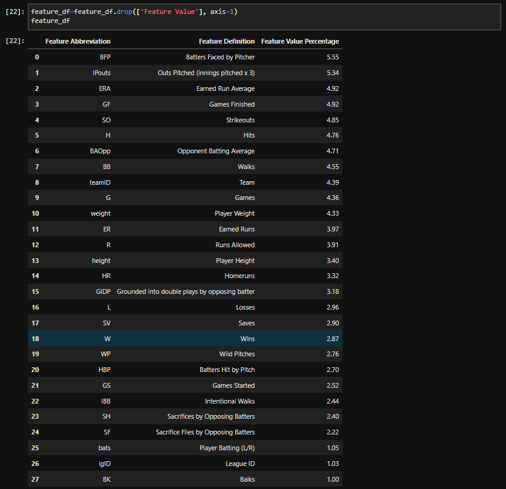

# Predicting Pitcher Salaries
## Topic
For this project, we will be creating a supervised machine learning model to take in MLB pitcher statistics to predict their expected salaries in the future.
 

## Reasoning
We selected this topic because an abundance of baseball statistics data is readily available online, and predicting pitcher salaries seemed like an interesting yet feasible challenge for machine learning.
 

## Data Sources
We will be using MLB pitching statistics and salary data for years 2016-2019 to train our model. We chose to use multiple years of data to imporove our model's accuracy. We chose not to include more recent years (2020 & 2021) because of the signinficant impact the COVID-19 pandemic had on professional sports. 

We sourced our pitching statistics and player salary data from [Lahman's Baseball Database.](http://www.seanlahman.com/baseball-archive/statistics/)
 

## What We Plan to Answer with Data
We hope to be able to find pitcher metrics that are strongly correlated with salary in order to predict what a pitcher's salary is expected to be in the future.

 

# Data Preprocessing
To better analyze the pitcher salary data, we needed to first combine and clean the data files we had. In order to attain all of the neccessary information for the analysis, we used three seperate CSV files - 1) Salaries 2) People & 3) Pitchers. The `Salaries.csv` file contained salary data for all players in the league, while the `Peoples.csv` containted their names and personal information, and the `Pitchers.csv` file contained stats for the pitchers. 

The first step in cleaning the data was combining the `Salaries.csv` and `Pitcher.csv` by merging the dataframes on the `Player ID` by using PANDAS. The next step was to filter by the years we wanted. For this analysis, we decided to use years 1990 - 2019, approzimately 30 years of data. This ensured that we would have enough quality data point. Next, the data was further filtered by the number of games started. To eliminate outliers and filter by only starting pitchers, we required a minimum of at least 3 games started. This essentially filtered out any closing pitchers or players who may have been called up briefly from the minor leagues. 

Next, the data had to be cleaned after being filtered. The first step in this process was to filter out any null values in the Salary column since these data points would be of no help. After this, a handful of columns were dropped because the stats they provided were either empty values or simply not relevant for this analysis. 

After this, the dataframe was combined with the `Players.csv` containing personal information. The purpose of linking the file was primarily to get the player names linked as well as some other stat such as height, weight, etc. The files were merged on the `Player ID` using PANDAS. Once the names were linked, the data was further cleaned by changing the column acronyms to their full names for readability. Unfortuantely, player age was not provided but we felt like this was an important data point to have. To attain the player age, we created a new column by subtracting the `Year` column from the `Year Born`. This effectively gave us the player age for each data point. 

With the dataframe effectively filtered and cleaned, the final steps were to organize the columns in a way that made sense and export the file as [`pitcher_salaries_cleaned.csv`](./data-cleaning/pitcher_salaries_cleaned.csv).

# The Machine Learning Model
To determine the initial machine learning model, we analyzed a dataset from 2010-2016 that had baseball salary and ERA statistics.  This is only an example dataset and the final will be for the years 2016-2019.  In the initial scatter plot below, we observed as the ERA decreased, the salary increased, but there were some outliers.  

 

After removing the outliers, the scatterplot below showed the same ERA/Salary relationship, but in a bit more detail.
 

As a result of the scatterplots, the inital machine learning model chosen was linear regression.  The linear regression line was fit based on the initial data and produced the following model with a training and testing score of .97.

 

As we develop the dataset, our machine learning model will evolve and employ unsupervised learning to find additional relationships to salary.  From the original dataset, there are ERA values of 0, so additional variables will need to be taken into consideration when predicting salary.  

## Random Forest Analysis
To help narrow down which features to focus on for our machine learning model, we employed a random forest analysis to obtain a ranking of the various features' importances (see below).
 
 
The details of the analysis (data preprocessing, random forest analysis, results, etc.) can be found [here](./random-forest-analysis/README_random-forest.md).

# Database
## Database Schema

# Presentation - Google Slides
https://docs.google.com/presentation/d/1bLOD9xRlKs59oyxRPALq-vUpr1tfs63MJF6HQ-OcI0s/edit?usp=sharing

 

# Tableau Dashboard
Our dashboard will be created using Tableau (Link to [Dashboard](https://public.tableau.com/app/profile/dan.jones7483/viz/MoneyBall2_0/AvgSalaryHeight)).

# Communication Protocol
Our team will communicate during class sessions and through our own project group Slack channel. Additionally, we will be meeting once a week outside of class to discuss progress, help each other, and ensure all segment deliverables are ready for submission by Sunday evening.
 

