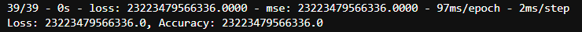
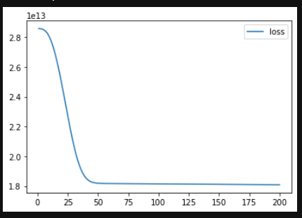
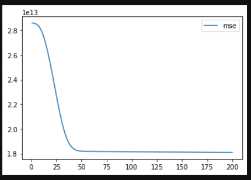
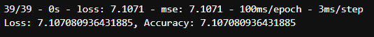
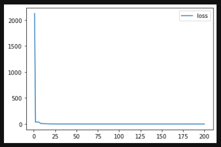
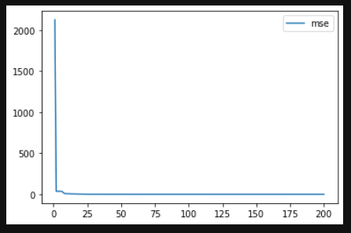

# Neural Network Model v1.0
Since neural networks are effective at modeling non-linear and complex relationships, we attempted to employ one for our salary-prediction project. 

## Data Prep
The dataset used is contained in the file `pitcher_salaries_cleaned.csv`. Details of how this dataset was preprocessed can be found [here](https://github.com/Jenny16x/TeamSix#data-preprocessing).

### *Reduction of Features*
In addition to the initial preprocessing of the data, less significant features (as determined by previous [random forest analysis](https://github.com/Jenny16x/TeamSix#random-forest-analysis)) were dropped from the dataframe to avoid confusing the neural network model. The final features included in the model were `ERA`, `Hits`, `Strike Outs`, `Outs Pitched`, `Batters Faced by Pitcher`, `Games Finished`, `Games Started`, and `Salary`.

## Naming Feature & Target Variables
The `Salary` column values were set as the target output, and the values from all other columns were set as the features. 

## Splitting Training & Testing Sets
The training and testing sets were split using the `train_test_split()` method from Scikit-learn.

## Standardization of Features
The features were standardized using `StandardScaler()`.

## Building the Neural Network Framework
Initially, there were two hidden layers defined, each with 21 neurons (the number of features x 3), and the output layer was set equal to 1. Each of the layers, including the output layer, were set to use the `linear` activation function.

 

## Compiling the Model

The loss metric chosen was `mean_squared_error`, which is suggested for regression problems. The optimizer used was `adam`, and the performance metric was set to `mse`.

## Training the Model
For this initial training set, 200 epochs were selected. This would hopefully ensure there were enough epochs to see if the model was training effectively, but few enough that there wouldn't be excessive wait times between runs.

## Evaluation of the Model
The loss and mse were calculated to be extremely large values (see image), indicating that the model needed significant optimization. 

 

Plots of the loss and MSE were also generated to help evaluate how well the model was able to learn.  

 

From these plots, the loss and MSE did improve over time, but after approximately 30-40 epochs the model plateaued and was unable to continue learning. The loss and MSE for this model were very extremely poor, demonstrating that there would either need to be significant optimization to make it work, or a neural network was not an appropriate model for this dataset. 

# Neural Net v2.0 - Log Transformation of Salary
Since the initial neural network model was ineffective at predicting salary, we aimed to see if we could improve the model by using a log-transformation on the salaries, since the salaries had such a wide distribution. 

 

The `Salary` column was log10 transformed using `np.log10()`, and a new column with the log-transformed salaries was generated and added to the dataframe. 

 

This time, the target ouput for the model was the log-transformed salary instead of the raw salary. All other aspects of the model were kept the same. 

## Evaluation of the Model
This model using the log-transformed salaries instead of raw salaries performed much better than the initial model. Unfortunately, the metrics were still demonstrating that the model was ineffective at predicting salaries.  

Looking at the metrics, loss and MSE are still very high. 

 

Additionally, viewing plots for the loss and MSE indicate that the model hits a plateau almost immediately, at around 5 epochs. 

 

 

# Analysis
Overall, after attempting several methods of optimizing the dataset and the model components, we were unable to produce a neural network model effective at predicting pitcher salary based on the pitcher's statistics. This indicated to us that we should try using a different type of model for our project.

