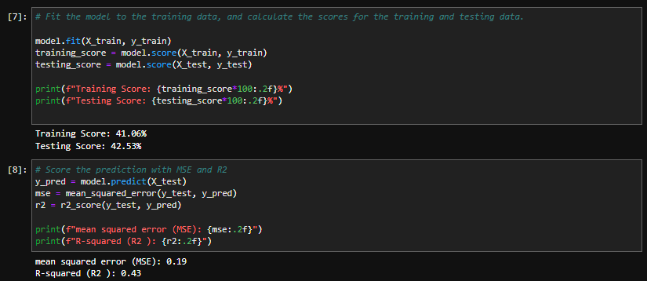

# Multivariate Regression Analysis

## Overview
Since we were interested in finding a linear relationship between salary and multiple features (pitching statistics) to predict salary, a multivariate regression analysis seemed like a reasonable model choice. 

## Preprocessing
The initial preprocessing of the data used can be found in the [data cleaning folder](https://github.com/Jenny16x/TeamSix/tree/main/data-cleaning). 

From there, the column names were abbreviated for simpler coding. The notebook and exported csv can be found below:

- Jupyter Notebook: [cleaning_col_names.ipynb](./cleaning_col_names.ipynb)
- CSV file: [`clean-col_outliers-IN.csv`](./resources/clean-col_outliers-IN.csv)

## Feature Selection
The features included in all multivariate regression analyses were:
- ERA
- Hits
- Earned Runs
- Strike Outs
- Home Runs
- Wins
- Losses
- Outs Pitched
- Batters Faced by Pitcher
- Games Finished
- Games Started 

The columns for `Year`, `Full Name`, `Age`, `League`, and `Team` were excluded as features for this analysis to keep the prediction based on actual pitcher statistics instead of other non-pitching related factors.  

## Model Creation
---

The training and testing sets were split using Scikit-learn's `train_test_split` method, and `LinearRegression()` was used as the model. 

## Results
---

### Original Dataset Analysis
> [Jupyter Notebook - Multivariate Regression with Outliers](./multivariate-regression_with-outliers.ipynb) 

The first analysis was run on the original dataset without removing outliers or transforming salary values.  

The results from this initial analysis are shown below: 

 

For this model, the training/testing scores were very poor, the MSE was incredibly high, and the R-squared value was low- all indicative that the model needed optimization. 

We then attempted to use `StandardScaler` and `MinMaxScaler`on the features to see if scaling would improve the model's metrics, but unfortunately this had very little effect on the model's performance. 

### Outliers Removed
> [Jupyter Notebook - Multivariate Regression without Outliers](./multivariate-regression_without-outliers.ipynb) 

The same analysis was run but this time with the outliers for `ERA`, `Salary`, and `Strike Outs` removed.  

Outliers were determined using the standard method of calculating IQR, determining the upper and lower bounds for each feature, then filtering to remove values outside the calculated bounds.  

The results from the analysis with outliers removed is shown below: 

 

Interestingly, removing the outliers actually caused the model's performance to deteriorate slightly, indicating that removal of outliers was not useful for this analysis. 

Once again, additional analyses using `StandardScaler` and `MinMaxScaler` on the features were attempted, but did not improve the model's performance. 

### Log-Transformed Salary

> [Jupyter Notebook - Multivariate Regression with Log10 Transformed Salary, with Outliers](./multivariate-logSal_outliers-included.ipynb) 

> [Jupyter Notebook - Multivariate Regression with Log10 Transformed Salary, without Outliers](./multivariate_logSal_outliers-removed.ipynb) 

Since the previous iterations of this model performed so poorly, a log-10 transformation was performed on the `Salary` column. Since there was so much variation in salary values, a log-10 transformation to scale the salaries might help improve the model's performance. 

The results from the dataset including and excluding outliers are shown below: 
 

#### *Log-Transformed, Outliers Included*
 

 

#### *Log-Transformed, Outliers Excluded*
 

 
With the log-10 transformed salary values, the multivariate regression model did perform better than when raw salary values were used. Additionally, including the outliers resulted in higher training/testing scores and R-squared, while excluding outliers resulted in an improved MSE.
 
 
Although transforming the salary values did improve the model, the training/testing scores were still less than 50%, the highest R-squared was 0.46, and the lowest MSE was 0.19- all indicative of poor predictive power in the model. 
 
 

## Discussion
---
Overall, the multivariate regression analysis model was not effective at predicting pitcher salary using pitching statistics. It's possible that the dataset we are working with is just not optimally suited for analysis with this model. 

One potential issue is that the statistics in our dataset do not have strong linear relationships with salary, which would make developing a model based on linear regression difficult to accomplish.  

It's possible a slightly more complex model that can take into account non-linear relationships might be better suited to use in a model to predict pitcher salary. 