# Segment 2

## Random Forest Analysis

### Rationale
In pitching, and baseball overall, there is an almost overwhelming variety of statistics to choose from. We wanted to focus only on key statistics to use as features in our machine learning model, so we needed a method of narrowing down which statistics would be best. We decided to employ a random forest analysis on our data and utilize the `feature_importances_` property to determine which pitcher features were more strongly correlated with pitcher salary.

### Cleaning Datasets

 Original datasets used in the random forest analysis:

 - `Pitching.csv` - pitcher statistics
 - `People.csv` - player information (i.e., height, weight, L/R handedness, etc.)
 - `Salaries.csv` - player salary data

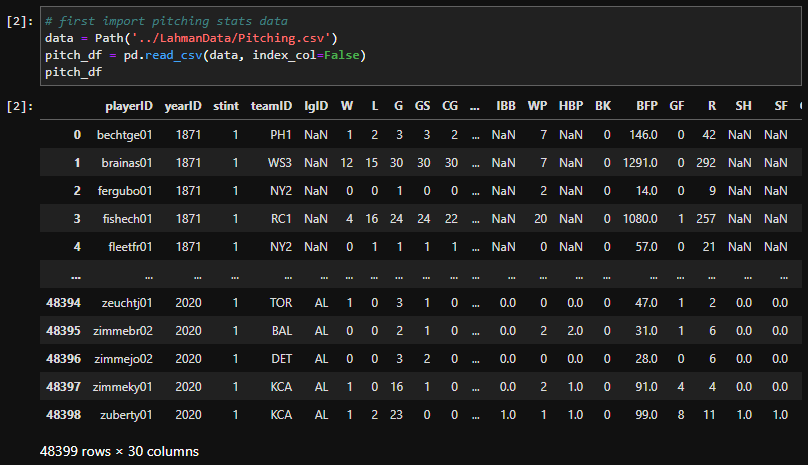

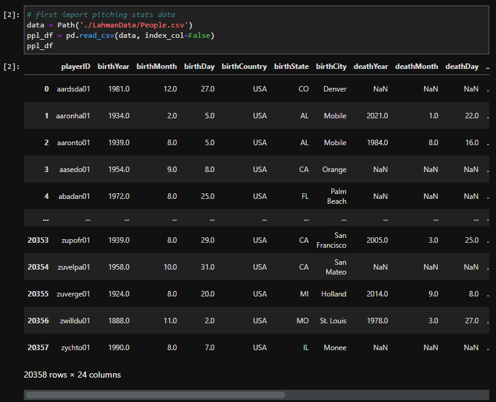

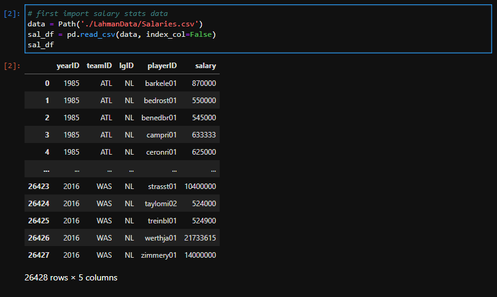

*Cleaning Pitching Statistics Data* 
[Jupyter Notebook- Cleaning Pitching Data](./jupyter-notebooks/cleaning-pitching-data.ipynb)
 
First, the pitching data was filtered to include only the years 2010-2019. We chose to include more years in the random forest analysis to give the model more data to work with when ranking the feature importances. After filtering by year, all rows with null values were dropped from the dataframe. 

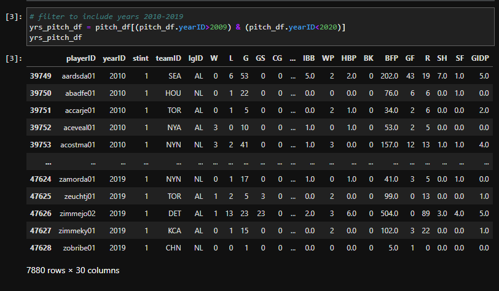
 

Next, a new column combining the `playerID` and `yearID` was created. Since the pitching and salaries dataframes have multiple rows with the same playerID for different years, having a unique ID that combines the `playerID` and `yearID` would help to reduce issues with merging later. This final dataframe was exported as a csv for later use ([Cleaned Pitching Data](./csv-files/2010-2019_pitching_clean.csv)).

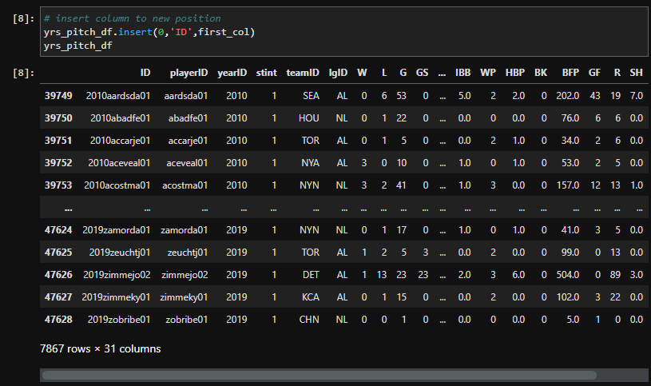

 

*Cleaning People Data* 
[Jupyter Notebook- Cleaning People Data](./jupyter-notebooks/cleaning-people-data.ipynb)
 
For this dataset, we only wanted to keep the columns for features that could potentially influence salary. The unnecessary columns were dropped, with the final dataframe including only `playerID`, `weight`, `height`, `bats`, and `throws`. This dataframe was exported as a csv for later use ([Cleaned People Data](./csv-files/2010-2019_people_clean.csv))
 
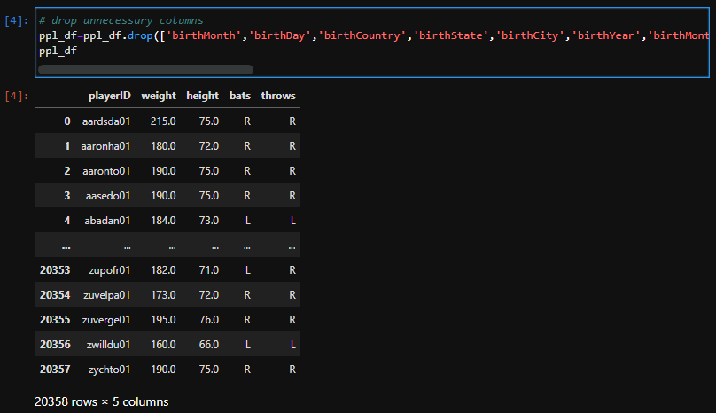

 

*Cleaning Salary Data* 
[Jupyter Notebook- Cleaning Salary Data](./jupyter-notebooks/cleaning-sal-data.ipynb) 
First, all rows with null values were dropped. Then the data was filtered to include only years 2010-2019. Lastly, the `yearID` and `playerID` columns were merged into a new column in the same manner as was done with the pitching data. The final dataframe was exported as a csv for later use ([Cleaned Salary Data](./csv-files/2010-2019_salaries_clean.csv))  
 

 

### Merging Datasets
[Jupyter Notebook- Merging Data](./jupyter-notebooks/merging-data.ipynb) 
First, the pitching and people dataframes were read in and merged on `playerID` using a left join. 
 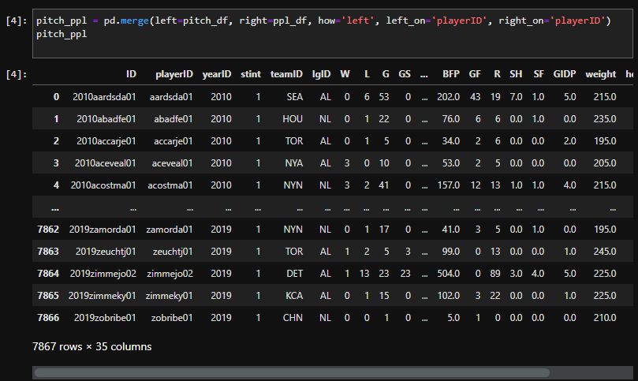 

Since the `playerID` would no longer be needed at this point, it was dropped along with the `yearID` column. 

Next, the salaries dataframe was read in. Since all we needed to merge was the `ID` column and `salary` column, all other columns were dropped from the dataframe. The salaries dataframe was then merged with the combined pitching/people dataframe, again using a left join. All rows with null values were dropped, resulting in the final dataset to be used in the random forest analysis. The dataframe was exported as a csv for later use ([Final Merged Dataset](./2010-2019_data.csv))
 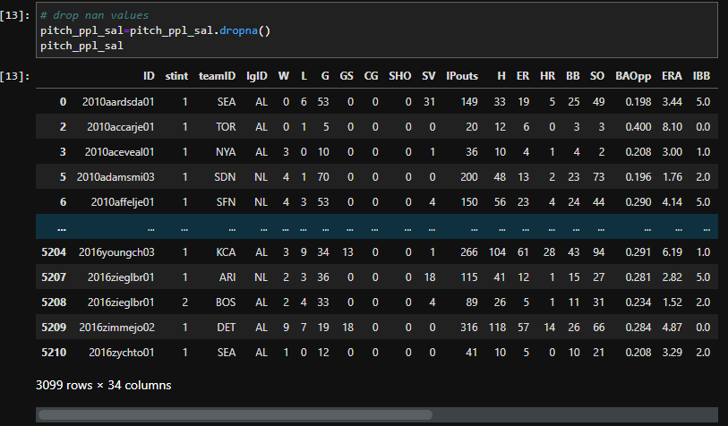 

### Encoding 
[Jupyter Notebook- Encoding Data](./jupyter-notebooks/encoding-data.ipynb) 
Since there were a few features (`teamID`, `lgID`, `throws`, and `bats`) that had string values, they needed to be encoded as numerical values to be included in the random forest analysis. To accomplish this `LabelEncoder` was utilized and a new encoded dataframe was created and exported as a csv ([Encoded Data](./encoded_data.csv))

### Binning
[Jupyter Notebook- Binning Salary Data](./jupyter-notebooks/binning-data.ipynb) 
An additional dataframe/csv was created with an additional `salary-bin` column, classifying each salary as either low, mid, or high. This would be used in addition to the unbinned dataset to see which worked better for the random forest analysis ([Binned Encoded Data](./csv-files/encoded_data_binned.csv)).

### Random Forest Analysis - Unbinned Data
[Jupyter Notebook- RF Analysis Unbinned](./jupyter-notebooks/RF-redo-unbinned.ipynb) 
The encoded-unbinned dataset was read in. The features (statistics) and target (salary) variables were defined. Training and Test sets were split using `train_test_split`. 
 
The data was then scaled using `StandardScaler()`, and the random forest model was created using `RandomForestClassifier()`.
 
The model was then fit, and predictions were made using the testing data. Next, the feature importances were determined, and sorted by their rank. 
  

Additionally, an accuracy score was run to determine the random forest model's accuracy in predicting salary from the provided features. The accuracy score was very low at just 1.67%. This would be used for comparison against the random forest analysis on binned data to see which performs better. 
 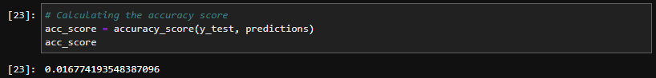 

### Random Forest Analysis - Binned Data
[Jupyter Notebook- RF Analysis Binned](./jupyter-notebooks/RF-redo-binned.ipynb) 
For this analysis, the exact same methods were employed as with the previous random forest analysis, only this time the salary bins were used as the target variable instead of the actual salary. This time around, the feature importances ranking appeared more consistent with what we would expect. 
 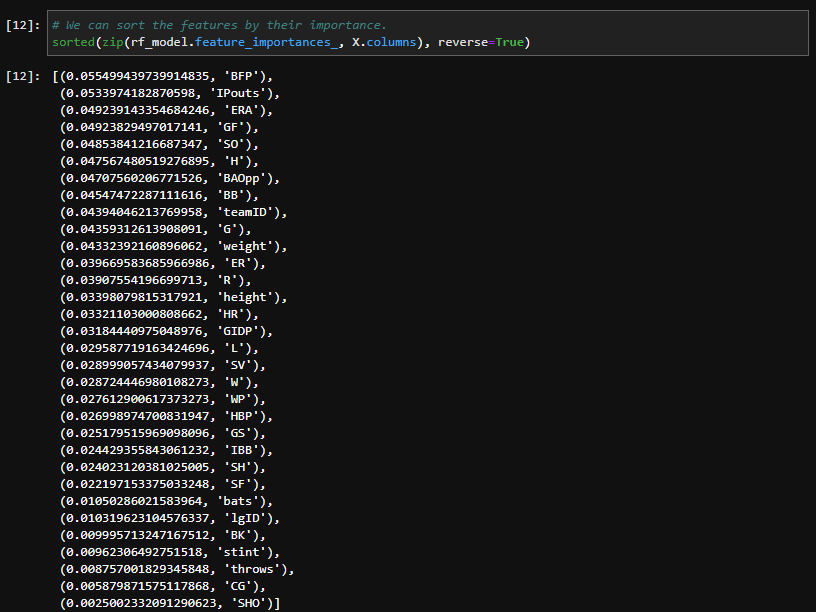 

Additionally, the accuracy score for this analysis was significantly higher at 52.5% versus the very low accuracy found with the analysis on the unbinned data. 
 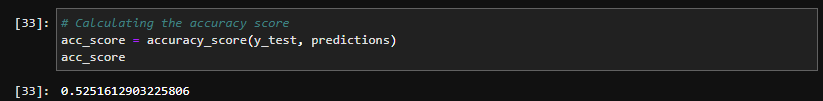 

Since the random forest analysis on the binned data performed much better, we decided to use this feature importance ranking as the basis for our feature selection as we move forward with developing our machine learning model.
 
The feature importances ranking was used to create a dataframe which would include the features, their definitions (pulled from [here](https://rdrr.io/cran/Lahman/man/Pitching.html)), and the feature importance percentage.
 

  
